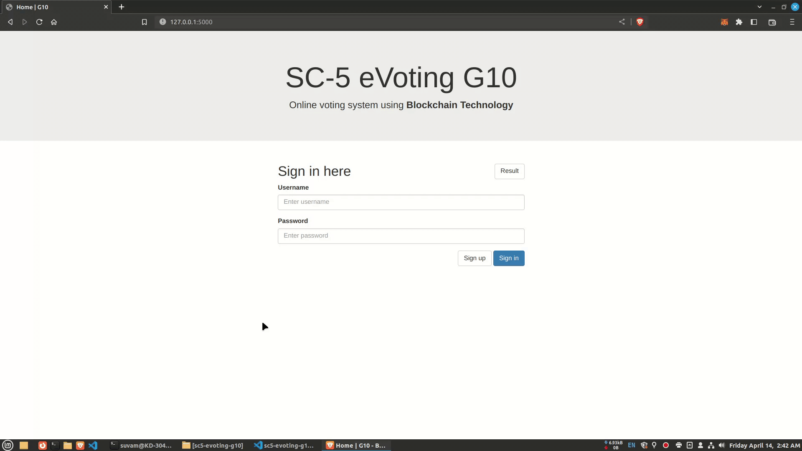

# SC5-eVoting-G10
eVoting system using the Ethereum blockchain  <br>
**Group**: 10 <br>
**Project code**: SC5
| Tech Stack |  |
| --- |:---:|
| Front-end | [HTML](https://html.com/), [Bootstrap](https://getbootstrap.com/) |
| Back-end | [Flask](https://flask.palletsprojects.com/en/2.2.x/), [web3.py](https://web3py.readthedocs.io/en/stable/) |
| API | [Infura](https://www.infura.io/) |
| Wallet | [MetaMask](https://metamask.io/) |


# File details
| Filename | Details |
| --- |:---|
| [candidates.csv](CSV/candidates.csv) | Automatically get inserted into the candidate table in the database with a fresh start |
| [admin.json](admin/admin.json) | Set the admin username, password, and wallet address. The contract address gets automatically added after deployment. Automatically get inserted into the database with a fresh start |
| [ABI.json](contract/ABI.json) | The ABI file gets automatically written after deployment |


# How to start the application
- Add the list of [candidates](CSV/candidates.csv)
- Set admin [credentials]((admin/admin.json))

## Add credentials

Add email ID and [App password](https://myaccount.google.com/apppasswords?pli=1&rapt=AEjHL4Ndhj6hBZ8LMGVrlFjQH-4vRUJUj_aCZ2LCPyzLqwcdwC8h3JEMP1bJfBZ9UaB46qpE5tY9dwQZ-KacKSTJJ4eetxWaxw) here: [dapp/credentials.py](/dapp/credentials.py)

```python
SENDER_EMAIL = "example@domain.com"
PASSWORD = "nx2189n&gs76"
```

To disable email service. OTP will be available in the terminal.
```python
EMAIL_SERVICE = False
```

Add `Infura` API
```python
WEB3_PROVIDER_URL = "https://sepolia.infura.io/v3/XXXXXXXXXXXXXXXXXXXXXXXXXXXXXXXX"
```

## Create virtual environment
The directory should be inside `sc5-evoting-g10`
```bash
suvam@KD-304A:~/Projects/sc5-evoting-g10$
```

Create
```bash
virtualenv .venv
```
Activate
```bash
. .venv/bin/activate
```
## Install dependencies 
Install dependencies from `requirements.txt`
```bash
pip install -r requirements.txt
```

## Deploy smart contract
It will prompt for the private key. Input will be `hidden`.
```bash
python deploy.py
```
- It will create `ABI.json` file
- Add the contract address in `admin.json`
## Start Flask application
1. Export app name
```bash
export FLASK_APP=dapp
```
2. Set debugging mode
```bash
export FLASK_DEBUG=1 
```
3. Start app </br>

For localhost
```bash
flask run
```
For LAN
```bash
flask run --host=0.0.0.0
```

# How to get the private key
1. Goto MetaMask
2. Three dot menu (top right side)
3. Select `Account details`
4. `Export private key`
5. Type your MetaMask `password`


# Demo

## Voter
-----
### Voter registration
<center>

</center>

### Voting
<center>

</center>

## Admin
---
### Set election time
<center>

</center>

### Publish election result
<center>

</center>